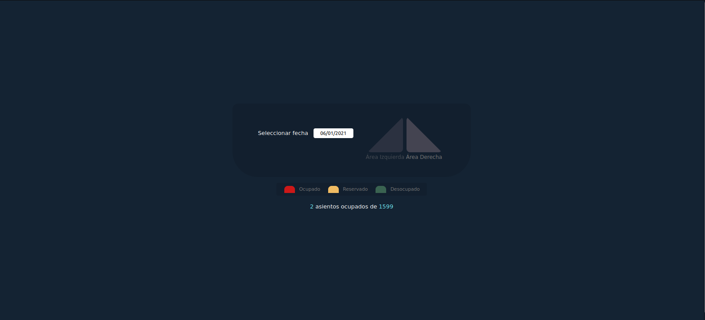
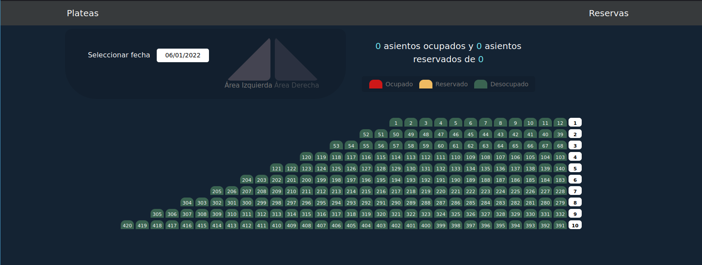
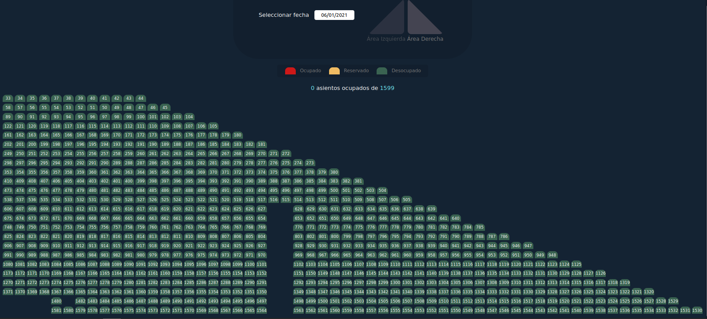
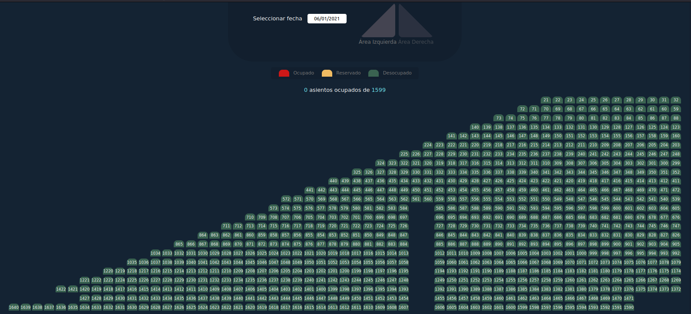

# Plateas web

## Requisitos
* NodeJs
* MongoDB

## Instalación
```
git clone https://github.com/anakloss/plateas_fullstack.git
cd plateas_fullstack
npm install
npm run dev
```

## Descripción
Desarrollo web para control de ventas de plateas para evento.

### Inicio
Selección de área en minimapa.




### Seguimiento de plateas reservadas
Listado con plateas y fecha de reservada.
